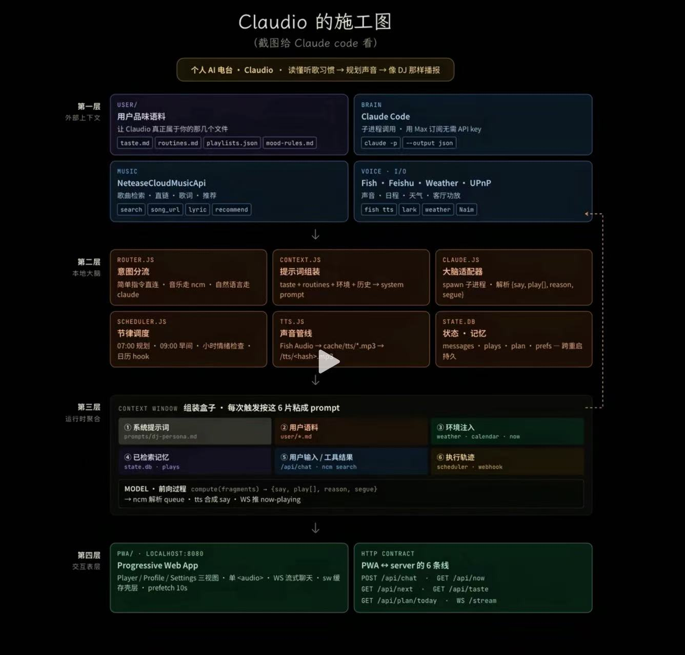

# opendio / Claudio 施工图

> 来源：用户提供的项目结构图截图。  
> 图片归档：[`docs/assets/opendio-construction-map.jpg`](assets/opendio-construction-map.jpg)



## 一句话目标

个人 AI 电台：读懂听歌习惯 → 规划声音 → 像 DJ 那样播报。

## 四层结构

1. **第一层：外部上下文**
2. **第二层：本地大脑**
3. **第三层：运行时聚合**
4. **第四层：交互表层**

## 核心输入：USER / 用户品味语料

让 Claudio / opendio 真正属于用户的文件：

- `taste.md`
- `routines.md`
- `playlists.json`
- `mood-rules.md`

## BRAIN：Claude Code

目标：作为本地大脑，通过子进程调用 Claude Code / Claude CLI。

- 使用 Max 订阅，无需额外 API Key
- `claude -p`
- 输出 JSON
- 目标结构：`{ say, play[], reason, segue }`

## MUSIC：NeteaseCloudMusicApi / 网易云音乐能力

目标：真实音乐库，而不是 demo preview。

能力：

- 歌曲检索：`search`
- 歌曲直链：`song_url`
- 歌词：`lyric`
- 推荐：`recommend`

## VOICE / I/O

外部能力：

- Fish Audio：TTS 声音
- Feishu / Lark：日程或通知
- Weather：天气上下文
- UPnP / Naim：客厅功放 / 外部播放设备

## 本地服务模块

### `router.js`：意图分流

- 商单/直接指令走直连
- 音乐相关走 ncm / 网易云能力
- 自然语言走 Claude

### `context.js`：提示词组装

把以下信息组合成 system prompt：

- taste
- routines
- 环境
- 历史

### `claude.js`：大脑适配器

- spawn 子进程
- 解析输出：`{ say, play[], reason, segue }`

### `scheduler.js`：节律调度

- 07:00 规划
- 09:00 早间
- 小时级情绪检查
- 日历 hook

### `tts.js`：声音管线

- FishAudio
- `cache/tts/*.mp3`
- `/tts/<hash>`

### `state.db`：状态 / 记忆

跨重启持久化：

- messages
- plays
- plan
- prefs

## Context Window：组装盒子

每次触发按 6 片拼成 prompt：

1. 系统提示词：`prompts/0-persona.md`
2. 用户语料：`user/*.md`
3. 环境注入：weather / calendar / now
4. 已检索记忆：`state.db` / plays
5. 用户输入 / 工具结果：`/api/chat` / ncm search
6. 执行轨迹：scheduler / webhook

## Model 前向过程

```txt
compute(fragments)
  → { say, play[], reason, segue }
  → ncm 解析 queue
  → tts 合成 say
  → WS 推 now-playing
```

## PWA / localhost:8680

交互层目标：

- Progressive Web App
- Player / Profile / Settings 三视图
- `<audio>` 播放
- WS 流式聊天
- Service Worker 缓存
- 壳层 prefetch 10s

## HTTP Contract

PWA server 的 6 条线：

- `POST /api/chat`
- `GET /api/now`
- `GET /api/next`
- `GET /api/taste`
- `GET /api/plan/today`
- `WS /stream`
